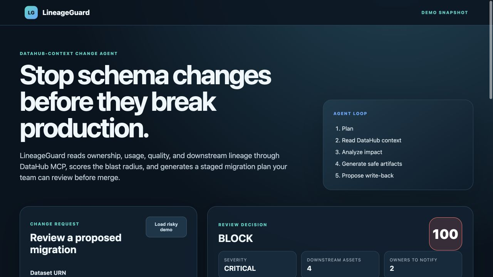

# LineageGuard

LineageGuard is a DataHub-context agent that reviews schema changes before they break downstream datasets, dashboards, pipelines, or ML models.

**Live demo:** https://lineageguard-datahub-agent.vercel.app

**Source:** https://github.com/ult666666/lineageguard-datahub-agent

**Build with DataHub category:** Metadata-Aware Code Generation & Development

**DataHub technology:** DataHub MCP Server



It reads ownership, usage, quality signals, and lineage through the DataHub MCP Server; scores the blast radius; and generates:

- a block / approval / proceed decision;
- owner notifications;
- staged migration SQL;
- validation tests;
- PR-ready review notes; and
- an approval-gated DataHub write-back plan.

## Why this matters

Schema changes are often reviewed from the edited table alone. DataHub knows the real blast radius: downstream consumers, owners, quality assertions, and usage. LineageGuard converts that context into a safe, reproducible change workflow.

## Run the demo

Requirements: Node.js 20+; no package installation is required.

```bash
npm test
npm run mcp:smoke
npm run demo
npm start
```

Open `http://127.0.0.1:4173`, click **Load risky demo**, and run the analysis.

The server binds to `127.0.0.1:4173` by default. Override either value when needed:

```bash
HOST=0.0.0.0 PORT=8080 npm start
```

## Use as a Codex skill

The repository includes a portable Codex skill at [`skills/lineageguard-schema-review`](skills/lineageguard-schema-review). It reviews database, warehouse, event, API, or data-contract changes and returns an evidence-backed `APPROVE`, `CONDITIONAL`, or `BLOCK` decision.

Install it locally:

```bash
cp -R skills/lineageguard-schema-review "${CODEX_HOME:-$HOME/.codex}/skills/"
```

Then ask Codex:

```text
Use $lineageguard-schema-review to assess renaming orders.total to gross_total.
```

The skill can query DataHub MCP in read-only mode, or score a redacted JSON manifest completely offline. Its deterministic scorer uses only the Python standard library:

```bash
python3 skills/lineageguard-schema-review/scripts/score_change.py change.json --format markdown
```

No API key, paid service, catalog mutation, or production data is required. Missing safety evidence is reported as uncertainty and increases risk instead of being silently treated as zero.

This Codex-native extension was added on July 14, 2026, after the OpenAI Build Week submission period opened, and is isolated from the original web MVP for clear review and testing.

### OpenAI Build Week evidence

- **Track:** Developer Tools.
- **New work:** the portable skill, deterministic scorer, risk policy, MCP evidence guide, tests, and this installation/testing documentation.
- **Codex model:** `gpt-5.6-sol`, verified from the persisted Codex thread metadata.
- **Required `/feedback` Codex Session ID:** `019f5815-17d2-7bd2-81cc-68d346d79d63`.
- **Dated source evidence:** commit `00a0d00` and [draft pull request #1](https://github.com/ult666666/lineageguard-datahub-agent/pull/1).
- **Public demo:** [2:35 narrated Build Week video](https://youtu.be/yMaMvqcoV7w), publicly viewable without repository access.

GPT-5.6 was used through Codex to design, implement, review, and verify the extension. The shipped skill itself stays local and deterministic, so judges can test it without an API key, paid credits, or access to private production data.

## Run with Docker

Requirements: Docker Engine or Docker Desktop.

Build the production image and run its test suite:

```bash
docker build -t lineageguard:local .
docker run --rm lineageguard:local npm test
```

Start LineageGuard in mock-data mode:

```bash
docker run --rm --name lineageguard -p 4173:4173 lineageguard:local
```

Open `http://127.0.0.1:4173` or verify the service directly:

```bash
curl --fail http://127.0.0.1:4173/api/health
```

To use a live DataHub MCP Server, pass credentials at runtime rather than storing them in the image:

```bash
docker run --rm --name lineageguard \
  -p 4173:4173 \
  -e DATAHUB_MCP_URL="https://<tenant>.acryl.io/integrations/ai/mcp/" \
  -e DATAHUB_MCP_TOKEN="<service-account-or-personal-token>" \
  lineageguard:local
```

The image runs as the unprivileged `node` user and includes a health check against `/api/health`.

## Connect a live DataHub MCP Server

The included snapshot keeps the demo reproducible. For live DataHub metadata, set:

```bash
export DATAHUB_MCP_URL="https://<tenant>.acryl.io/integrations/ai/mcp/"
export DATAHUB_MCP_TOKEN="<service-account-or-personal-token>"
npm start
```

LineageGuard calls the DataHub MCP tools `get_entities` and `get_lineage`. Mutation is deliberately approval-gated: the first release generates a write-back proposal rather than changing catalog state automatically.

## Verify the DataHub MCP path without a tenant

Run the bounded local smoke test:

```bash
npm run mcp:smoke
```

The test starts an ephemeral Streamable HTTP MCP server on `127.0.0.1`, completes one MCP initialization and session handshake, exercises `get_entities` and downstream `get_lineage`, and validates the official DataHub MCP argument and response shapes. It uses no network service, credential, paid API, or persistent port.

This is a transport and adapter validation, not a claim that the public demo is connected to a live DataHub tenant. Live-tenant testing remains an optional follow-up using the environment variables above.

## Architecture

```text
Change request
   │
   ▼
LineageGuard agent ──► DataHub MCP ──► schema, owners, usage, quality, lineage
   │
   ├── blast-radius scoring
   ├── staged migration SQL
   ├── validation checklist
   ├── PR review document
   └── approval-gated DataHub write-back plan
```

## Build with DataHub hackathon category

Primary: **Metadata-Aware Code Generation & Development**.

LineageGuard reads real schemas, ownership, usage signals, tags, quality context, and downstream lineage through the DataHub MCP Server, then generates merge-ready migration SQL, validation checks, owner notifications, and a PR review. This directly matches the category's requirement that generated production data code be grounded in DataHub context and delivered as repository artifacts a data team could review.

The app also prepares an approval-gated DataHub write-back plan, but it does not claim an automatic catalog mutation. For that reason, the submission targets the metadata-aware code-generation category rather than relying on the separate write-back language in **Agents That Do Real Work**.

The project is newly created during the July 6–August 10, 2026 submission window. DataHub is the required context layer, and the MCP Server is the required agent integration.

## Safety model

- Read operations are automatic.
- Schema changes are never executed by the app.
- DataHub mutations remain proposed until an authorized person approves them.
- Migration SQL is additive by default and includes explicit validation gates.
- The demo contains synthetic metadata only.

## Codex collaboration

The project owner set the product goal, strict USD 0 budget, and approval-gated safety boundary. The owner also made the key product decisions: schema changes must never execute automatically, missing production evidence must increase risk rather than disappear, and judges must be able to test the extension without paid infrastructure.

Working in the GPT-5.6 Codex thread above, Codex translated those constraints into the reusable skill, deterministic scoring policy, MCP evidence contract, tests, and public documentation. Codex accelerated implementation and edge-case review; the owner retained authority over product scope and every external publication step. The deterministic risk policy keeps the core deployment decision auditable: Codex explains evidence and generates mitigations without being allowed to execute a schema change.

## Repository status

The public Apache-2.0 MVP is deployed, its browser/API workflow is operational, all ten tests pass, GitHub detects the Apache-2.0 license, and the screenshots and submission copy are ready. A separate DataHub-tailored video with public visibility is still required before the DataHub Devpost entry is submitted. The existing unlisted video is an OpenAI Build Week asset and is not the DataHub submission video. A live DataHub tenant remains optional follow-up work because the bounded local MCP smoke test covers transport and official tool-shape validation without claiming tenant validation.
